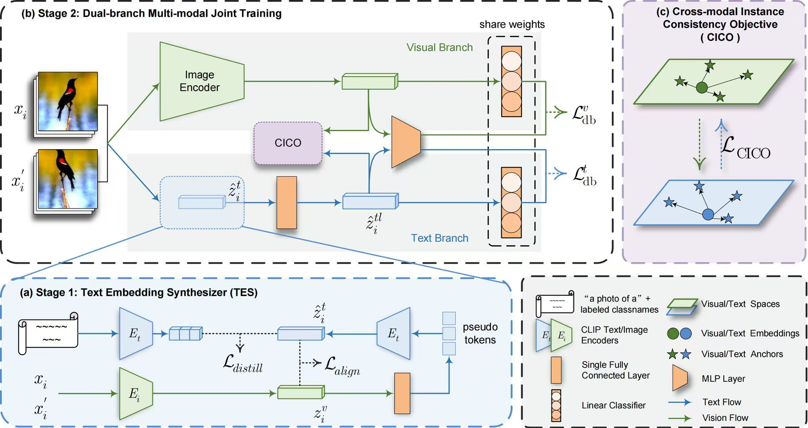

# GET: Unlocking the Multi-modal Potential of CLIP for Generalized Category Discovery (CVPR2025)

<p align="center">
    <a href="https://cvpr.thecvf.com/virtual/2025/poster/34519"></a>
    <a href="https://arxiv.org/abs/2403.09974"></a>
  <a href="https://github.com/enguangW/GET/blob/master/LICENSE"></a>
</p>
<p align="center">
	 Official implementation of our CVPR2025 paper "GET: Unlocking the Multi-modal Potential of CLIP for Generalized Category Discovery" <br>
</p>

## 📖 Introduction



Given unlabelled datasets containing both old and new categories, generalized category discovery (GCD) aims to accurately discover new classes while correctly classifying old classes.  Current GCD methods only use a single visual modality of information, resulting in a poor classification of visually similar classes. 
As a different modality, text information can provide complementary discriminative information, which motivates us to introduce it into the GCD task.
However, the lack of class names for unlabelled data makes it impractical to utilize text information.
To tackle this challenging problem, in this paper, we propose a Text Embedding Synthesizer (TES) to generate pseudo text embeddings for unlabelled samples. Specifically, our TES leverages the property 
that CLIP can generate aligned vision-language features, 
converting visual embeddings into tokens of the CLIP’s text 
encoder to generate pseudo text embeddings. Besides, we employ a dual-branch framework, through the joint learning and instance consistency of different modality branches, visual
and semantic information  mutually enhance each other,
promoting the interaction and fusion
of visual and text knowledge.
Our method unlocks the multi-modal potentials of CLIP and outperforms the baseline methods by a
large margin on all GCD benchmarks, achieving new state-of-the-art.


## 🚀 Getting Started

### 1. Datasets

We use the standard benchmarks in this paper, including:

* Generic datasets：[CIFAR-10/100](https://pytorch.org/vision/stable/datasets.html) and [ImageNet-100/1K](https://image-net.org/download.php)

* Fine-grained datasets: [The Semantic Shift Benchmark (SSB)](https://github.com/sgvaze/osr_closed_set_all_you_need#ssb) and [Herbarium19](https://www.kaggle.com/c/herbarium-2019-fgvc6)

### 2. Dependencies

```
pip install -r requirements.txt
```

### 3. Config

Set paths to datasets and desired log directories in ```config.py```


### 4. Train the model

Train GET on the Stanford Cars dataset: 

```
bash scripts/run_scars.sh
```


## 📝 Citing this work 

If you find this repo useful for your research, please consider citing our paper:

```
@article{wang2024get,
  title={GET: Unlocking the Multi-modal Potential of CLIP for Generalized Category Discovery},
  author={Wang, Enguang and Peng, Zhimao and Xie, Zhengyuan and Yang, Fei and Liu, Xialei and Cheng, Ming-Ming},
  journal={arXiv preprint arXiv:2403.09974},
  year={2024}
}
```

## 🎁 Acknowledgements
 Our codebase  relies on [SimGCD](https://github.com/CVMI-Lab/SimGCD). Thanks for their excellent work!

##  🎫 License

This project is licensed under the MIT License - see the [LICENSE](LICENSE) file for details.

## 📧 Contact

If you have further questions or discussions, feel free to contact me:

Enguang Wang (enguangwang12@gmail.com)